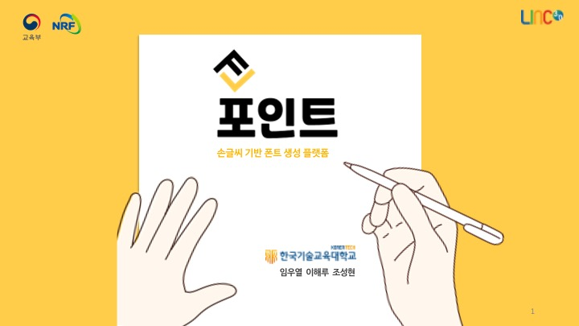
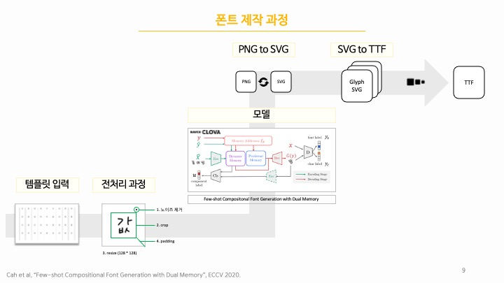
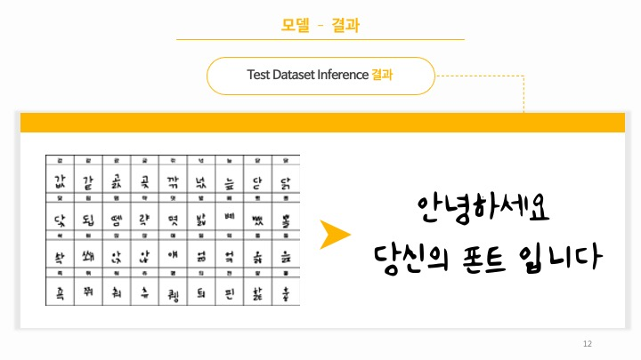
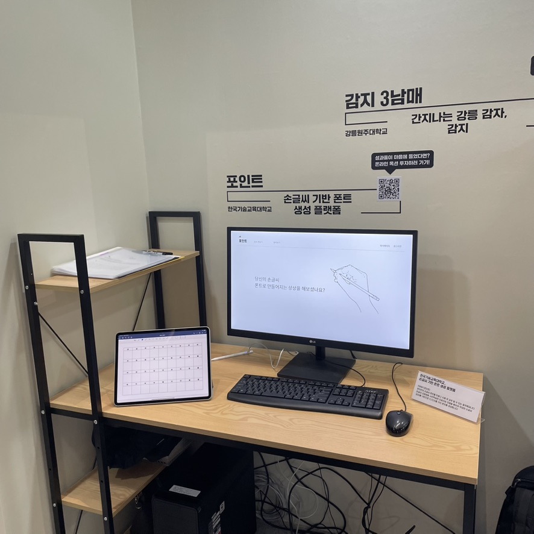
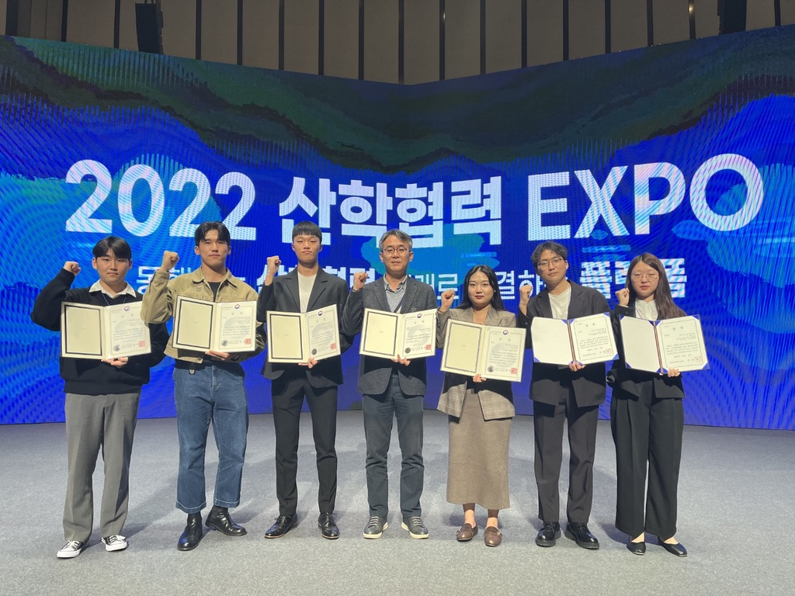

# HandWriteFont_BE

## Forint - 포인트
## 2022 산학협력 EXPO LINC+ 캡스톤 디자인 경진대회 - 교육부 장관상 수상

URL: https://uicexpo.org/bbs/capston.php?bo_id=auction15
업무포지션: ML, BACKEND
투입기간: 2022/02/01 → 2022/06/01

[2022 산학협력 EXPO](https://uicexpo.org/bbs/capston.php?bo_id=auction15)

<aside>
💡 2022년 3단계 산학연협력 선도 대학 육성사업 (LINC 3.0) 캡스톤디자인 경진대회 - 대상(`교육부 장관상`) 수상

</aside>

# Introduce

영어와 달리 한글은 `초,중,종성이라는 조합법`이 따로 존재하여 쉽게 손글씨를 폰트로 만들어낼 수 없었습니다. 

 그렇기에 이전 인공지능 모델들은 `Style-GAN`을 활용하여 폰트를 만들게 되었고 좋은 글씨가 나오지 않았습니다. 

 하지만 2021년 Naver CLOVA 팀에서 만든 FFG모델 중 `DM-FONT 모델을 사용`하여 한글의 조합법을 학습하는 모델을 통하여 훨씬 좋은 퀄리티의 폰트를 만들 수 있게 되었고 저희 팀은 해당 모델을 사용하여 `36자의 글자를 11,172자를 가진 폰트로 만들어 내는 서비스를 구현`할 수 있게 되었습니다.

# Video

[손글씨기반폰트생성플랫폼_시연.mp4](doc/손글씨기반폰트생성플랫폼_시연.mp4)

# My Position

Server : `Django RESTful Framework` 를 사용하여 백 엔드 개발을 진행하였으며 `API 명세서 작성, DB 설계` 등의 백 엔드에 필요한 모든 과정을 개발하였습니다.

AI : `AI 모델 선정`, `데이터 셋 수집/정제`, 모델 학습, `모델 인퍼런스 기능 추가` 등의 AI 모델을 위한 모든 과정을 개발하였습니다.

Infra : 프로토 타입으로 제작된 프로젝트였기에 배포를 위한 프로젝트의 `Dockerization`을 모두 진행하였고 전시를 위한 모든 과정을 개발하였습니다.

# 전시회

# Detail

[HandWriteFont](https://velog.io/@wooyeol/FORINT-손글씨기반-폰트-생성-플랫폼)
